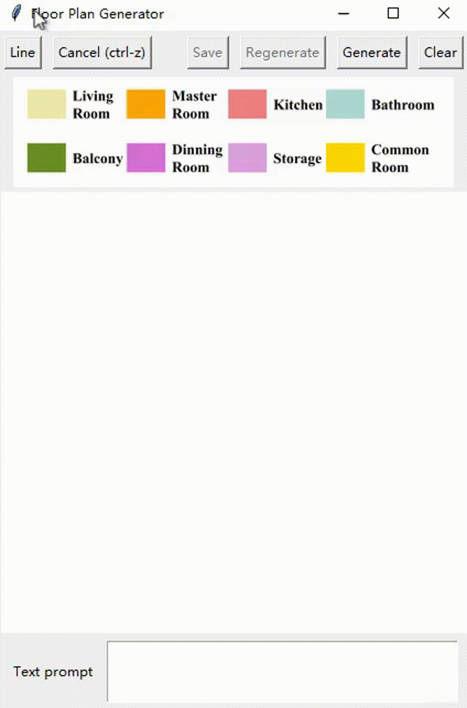

# ChatHouseDiffusion

Large language models and diffusion models are used to generate and edit the room plan with text prompts.

## Data

Our training data is based on the [RPLAN dataset](http://staff.ustc.edu.cn/~fuxm/projects/DeepLayout/index.html) and we evaluate our method's performance using the [Tell2Design dataset](https://github.com/LengSicong/Tell2Design).

The training data can be downloaded in <https://cloud.tsinghua.edu.cn/f/cda4cb89daef4da2b158/>
 and the test data (We use moonshot-v1-8k to preprocess the input texts in Tell2Design dataset) can be downloded in <https://cloud.tsinghua.edu.cn/f/2844208e0c344d18bd72/>

## Quick start

We've implemented a UI for ChatHouseDiffusion and you can use it directly. (This environment has been tested and works on Windows 10 with Python 3.10)

1. Install relative packages.

    ```shell
    pip install -r requirements
    ```

2. Download the predict model and unzip it in `predict_model`.
the model and parameters can be downloaded in <https://cloud.tsinghua.edu.cn/f/a01a8205be55462685fd/>

3. Create `api_info.json` with your own api infomation in the root path. Any LLM using OpenAI package is supported, such as GPT4, Kimi, Ollama, etc.

    ```json
    {
    "api_key": "<your api_key>",
    "base_url": "https://api.moonshot.cn/v1",
    "model": "moonshot-v1-8k"
    }
    ```

4. Run

    ```shell
    python ui.py
    ```

The demo is shown following:



## Train and test

You can read `train.py` and edit some parameters. Run `python train.py` for training a new model.

You can read `test.py` and edit some parameters. Run `python test.py` for testing.

You can read `predict.py` and change model, editing inject step or sampling timesteps for the ui.

## Method

Our code is based on [Imagen-pytorch](https://github.com/lucidrains/imagen-pytorch) and [Graphormer](https://github.com/microsoft/Graphormer).

The specific method can be found in our paper.

## Citation

Please cite this paper if you use the code.

```bib
@misc{qin2024chathousediffusionpromptguidedgenerationediting,
      title={ChatHouseDiffusion: Prompt-Guided Generation and Editing of Floor Plans}, 
      author={Sizhong Qin and Chengyu He and Qiaoyun Chen and Sen Yang and Wenjie Liao and Yi Gu and Xinzheng Lu},
      year={2024},
      eprint={2410.11908},
      archivePrefix={arXiv},
      primaryClass={cs.HC},
      url={https://arxiv.org/abs/2410.11908}, 
}
```
